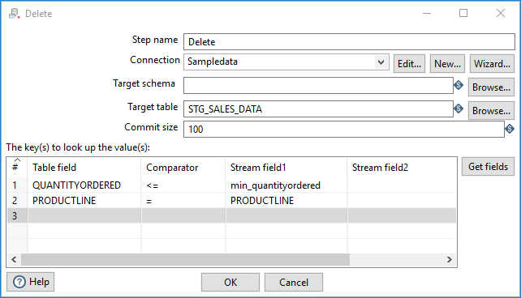

:documentationPath: /plugins/actions/
:language: en_US
:page-alternativeEditUrl: https://github.com/project-hop/hop/edit/master/plugins/transforms/delete/src/main/doc/delete.adoc
= Delete

== Description

The delete step deletes rows of data from a database. This step is similar to the update family of steps in that it takes one or more key fields to determine the rows to delete.

== Options

[width="90%", options="header"]
|===
|Option|Description
|Step name|Name of the step. This name has to be unique in a single transformation.
|Connection|The database connection to which data is written
|Target schema|The name of the Schema for the table to which data is written. This is important for data sources that allow for table names with periods in them.
|Target table|Name of the table in which you want to do the insert or update.
|Commit size|The number of rows to change (insert / update) before running a commit.
|The keys(s) to look up the value(s)|Specify fields to delete the corresponding rows for
|===
