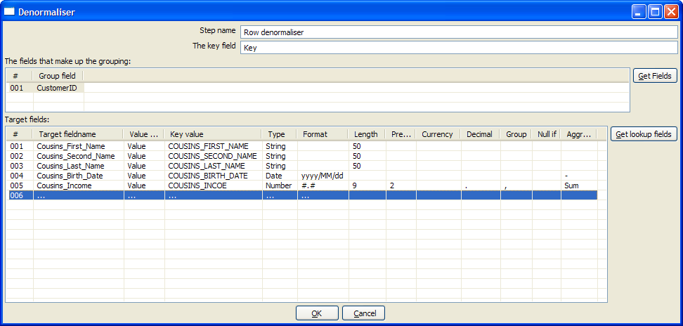

:documentationPath: /plugins/transforms/
:language: en_US
:page-alternativeEditUrl: https://github.com/project-hop/hop/edit/master/plugins/transforms/denormaliser/src/main/doc/denormaliser.adoc
== Row Denormaliser

== Description

The De-normalizer step allows you de-normalize data by looking up key-value pairs. It also allows you to immediately convert data types.

== Options

[width="90%", options="header"]
|===
|Step name|Name of the step. This name has to be unique in a single transformation.
|Key field|The field that defined the key of the output row.
|Group fields|Specify the fields that make up the grouping here.
|Target fields|Select the fields to de-normalize by specifying the String value for the key field (see above).
Options are provided to convert data types.
Strings are most common as key-value pairs so you must often convert to Integer, Number or Date.
If you get key-value pair collisions (key is not unique for the group specified) specify the aggregation method to use.
|===

== Metadata Injection Support
You can use the Metadata Injection supported fields with ETL Metadata Injection step to pass metadata to your transformation at runtime. The following Value fields of the Row Denormaliser step support metadata injection:

* Target Filename, Value Fieldname, Key Value, Type, Format, Length, Precision, Currency, Decimal, Group, and Aggregation

== Example

[width="90%", options="header"]
|===
|CustomerId|Key|Value
|101|COUSINS_FIRST_NAME|Mary
|101|COUSINS_SECOND_NAME|J.
|101|COUSINS_LAST_NAME|Blige
|101|COUSINS_BIRTH_DATE|1969/02/14
|101|COUSINS_INCOME|1723.86
|101|...45 more keys...|...
|===

