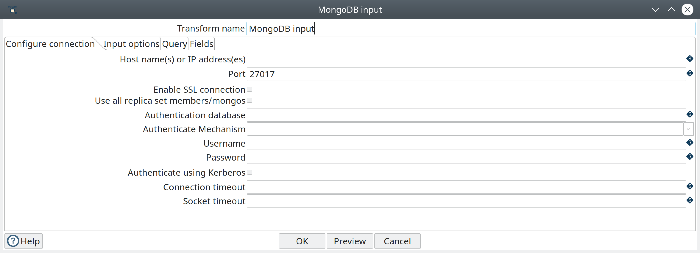
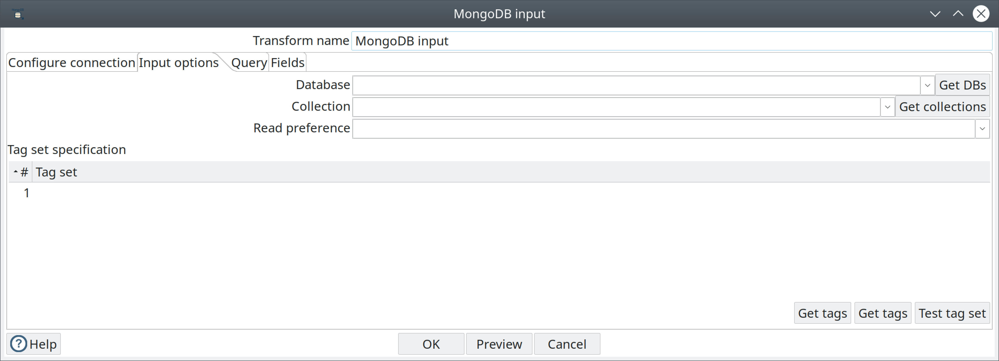
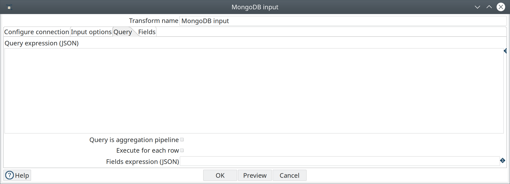
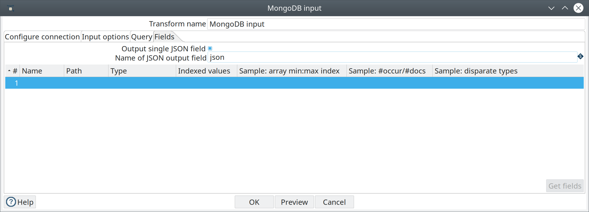

:documentationPath: /plugins/transforms/
:language: en_US
:page-alternativeEditUrl: https://github.com/apache/incubator-hop/edit/master/plugins/transforms/mongodb/src/main/doc/mondodbinput.adoc

= MongoDB Input

== Description

The MongoDB Input pipeline transform enables you to retrieve http://docs.mongodb.org/manual/reference/glossary/[documents] or http://docs.mongodb.org/manual/reference/glossary/[records] from a collection within MongoDB.
For additional information about MongoDB, see the MongoDB http://www.mongodb.org/[documentation].

== Options


=== General

Transform name : Specify the unique name of the MongoDB Input transform in the pipeline.
Preview button:  Display the rows generated by this transform. Enter the maximum number of records that you want to preview, then click OK. The preview data appears in the Examine preview data window.

=== Configure Connection tab



|===
|Field |Description

|Host name(s) or IP address(es)
|Specify the network name or address of the MongoDB instance or instances. You can also specify a different port number for each host name by separating the host name and port number with a colon. You can input multiple host names or IP addresses, separated by a comma.

|Port
|Specify the port number of the MongoDB instance or instances. Use this to specify a default port if no ports are given as part of the host name(s) or IP address(es) field. The default value is 27017.

|Enable SSL connection
|Specify to connect to a MongoDB Server that is configured with SSL.

|Use all replica set members/mongos
|Select to use all replica sets when multiple hosts are specified in the Host name(s) or IP address(s) field. If a replica set contains more than one host, the Java driver discovers all hosts automatically. The driver connects to the next replica set in the list if the selected set is unavailable.

|Authentication database
|Specify the authentication database.

|Authenticate Mechanism
|Select the method used to verify the identity of users. The values are SCRAM-SHA-1, MONGODB-CR and PLAIN.

|Username
|Specify the username required to access the database. When using Kerberos authentication, enter the Kerberos principal.

|Password
|Specify the password associated with the username. If you are using Kerberos authentication, you do not need to enter the password.

|Authenticate using Kerberos
|Select to specify authentication using Kerberos. When selected, enter the Kerberos principal as the Username.

|Connection timeout
|Specify (in milliseconds) how long to wait for a connection to a database before terminating the connection attempt. Leave blank to never terminate the connection.

|Socket timeout
|Specify (in milliseconds) how long to wait for a write operation before terminating the operation. Leave blank to never terminate the operation.

|===

=== Input options tab



The Input options tab enables you to specify which database and collection you want to retrieve information from. You can also indicate the read preferences and tag sets in this tab.

Enter the following information in the Input options fields:


|===
|Option|Definition

|Database
|Name of the database to retrieve data from. Click Get DBs to populate the drop-down menu with a list of databases on the server.

|Collection
|Name of the collection to retrieve data from. Click Get collections to populate the drop-down menu with a list of collections within the database.

|Read preference
|Specify which node to read first: Primary, Primary preferred, Secondary, Secondary preferred, or Nearest.

|===

==== Tag set specification table

Tags allow you to customize write concerns and read preferences for a replica set. The Tag set specification table allows you to specify criteria for selecting replica set members. See Tag Sets for more information.

Enter the following information in the Tag Set fields:


|===
|Field|Description

|#
|Indicates the number of the tag set.

|Tag set
|Displays the tag set criteria. You can join, delete, copy, and paste tag sets, then click Test tag set to see which replica set members match your Tag set specification criteria.

|Get Tags
|Click Get tags to retrieve a list of tag sets in the source database. Set are listed in order of execution.

|Join tags
|Click Join tags to append selected tag sets so that nodes matching the criteria are queried or written to simultaneously. If you select individual tag sets, then click Join tags, the tag sets are combined to create one tag set. Note that this change only occurs in the MongoDB Input window, not on the database.

|Test tag set
|Click Test tag set to display set members that match the tags indicated in the tag set specification. The ID, host name, priority, and tags for each replica set member that matches the tag set specification criteria are displayed.

|===

=== Query tab



The Query tab enables you to refine read requests. This tab operates in two different query modes:

* *Query expression* mode (default)
* *Aggregation pipeline specification* mode.

The *Query is aggregation pipeline* option toggles between these two modes.
The Query expression uses MongoDB’s JSON-like query language with query operators to perform https://docs.mongodb.com/manual/reference/operator/query/[query operations].
The *Aggregation pipeline specification* field uses MongoDB’s http://docs.mongodb.org/manual/applications/aggregation/[aggregation framework] to transform and combine documents in a collection.
An aggregation pipeline connects several https://docs.mongodb.com/manual/core/aggregation-pipeline/#pipeline-expressions[pipeline expressions] together, with the output of the previous expression becoming the input for the next.

Enter the following information in the Query fields:


|===
|Fields/Option |Definition

|Query expression (JSON)
|Enter a query expression in this field to limit the output.

|Aggregation pipeline specification (JSON)
|Select the *Query is aggregation pipeline* option to display the *Aggregation pipeline specification (JSON)* field. Then enter a pipeline expression to perform aggregations or selections. The method name, including the collection name of the database you selected in the Input Options tab, appears after the label for this field.

|Query is aggregation pipeline
|Select this option to use the aggregation pipeline framework.

|Execute for each row
|Select this option to perform the query on each row of data.

|Fields expression (JSON)
|Enter an argument to control the projection (fields to return) from a query. If empty, all fields are returned. This field is only available for query expressions.

|===

=== Fields tab



Use the Fields tab to define properties for exported fields.
The Fields tab operates in two different modes:

1. including all fields in a single JSON field
2. including selected fields in the output.

If you store the output in a single JSON field, you can parse this JSON using the JSON Input transform, or by using a User Defined Java Class transform.

*Note:* All fields in the Fields tab except the Name of JSON output field are inactive when the Output single JSON field is selected.
When the Output single JSON field is not selected, the Name of JSON output field is inactive.

General options:

* *The Get fields button*:  Click it to generate a sample set of documents. You can edit the list of field names, paths, and data type for each field in the sample.
* *Output single JSON field*: Specify that the query results in a single JSON field with the String data type (default).
* *Name of JSON output field*: Specify the field name of containing the JSON output from the server.


Enter the following information in the table if you want to output distinct fields:


|===
|Option| Definition

|#
|The order of this entry in the list.

|Name
|The name of the field based on the value in the Path field. The name that appears here maps the name of the field as it appears in the PDI transformation with the field that appears in the MongoDB database. You can edit the name.

|Path
|Indicates the JSON path of the field in MongoDB. If the path shown is an array, you can specify a specific element of the array by passing it the key value in the bracketed part of the array. For example, $.emails[0] indicates that you want the result to display the first value in the array.
To display all array values, use the asterisk as the key, like this $.email[*]. If the array contains records, and not just strings, you can specify that you want to display the record like this: $.emails[].sender.

|Type
|Indicates the data type.

|Indexed values
|Specify a comma-separated list of legal values for String fields. When you specify values in this field, the Kettle indexed data type is applied to the data. If no values are specified, the String data type is applied. Usually, you will only need to modify this field if you are using Weka metadata for nominal fields.

|Sample: array min: max index
|Indicates minimum and maximum values for the index in the sampled documents.

|Sample: #occur/#docs
|Indicates how often the field occurs and the number of documents processed.

|Sample: disparate types
|Indicates if different data types populate the same field in the sampled documents. When several documents are sampled and the same field contain different data types, the Sample: disparate types field is populated with a Y and the Type field displays the String data type. The Kettle type for the field is set to the String data type, for different output value types.

|===

== Examples

The following sections contain examples of query expressions and aggregate pipelines.

=== Query expression

MongoDB allows you to select and filter documents in a collection using specific fields and values.
The http://docs.mongodb.org/manual/reference/mongodb-extended-json/[MongoDB Extended JSON] documentation details how to use queries. Pentaho supports only the features discussed on this page.

The following table displays some examples of the syntax and structure of the queries you can use to request data from MongoDB:


|===
|Query expression |Description

|```{ name : "MongoDB" }```
|Queries all values where the name field has a value equal to MongoDB.

|```{ name : { '$regex' : "m.*", '$options' : "i" } }```
|Uses a regular expression to find name fields starting with m, case insensitive.

|```{ name : { '$gt' : "M" } }```
|Searches all strings greater than M.

|```{ name : { '$lte' : "T" } }```
|Searches all strings less than or equal to T.

|```{ name : { '$in' : [ "MongoDB", "MySQL" ] } }```
|Finds all names that are either MongoDB or MySQL (Reference).

|```{ name : { '$nin' : [ "MongoDB", "MySQL" ] } }```
|Finds all names that are not either MongoDB or MySQL, or where the field is not set .

|```{ created_at : { $gte : { $date : "2014-12-31T00:00:00.000Z" } } }```
|Finds all created_at documents that are greater than or equal to the specified UTC date.

|```{ $where : "this.count == 1" }```
|Uses JavaScript to evaluate a condition.

|```{ $query: {}, $orderby: { age : -1 } }```
|Returns all documents in the collection named collection sorted by the age field in descending order.

|===

=== Aggregate pipeline

MongoDB allows you to select and filter documents using the http://docs.mongodb.org/manual/tutorial/aggregation-examples/[aggregation] pipeline framework.
The Aggregation page in the MongoDB documentation provides additional examples of function calls.

The following table displays some examples of the query syntax and structure you can use to request data from MongoDB:


|===
|Query expression |Description

|```{ $match : {state : "FL", city : "ORLANDO" } }, {$sort : {pop : -1 } }```
|Returns all fields from all documents where the state field has a value of FL and the city field has a value of ORLANDO. The returned documents will be sorted by the pop field in descending order.

|```{ $group : { _id: "$state"} }, { $sort : { _id : 1 } }```
|Returns one field named _id containing the distinct values for state in ascending order. This is similar to the SQL statement SELECT DISTINCT state AS _id FROM collection ORDER BY state ASC.

|```{ $match : {state : "FL" } }, { $group: {_id: "$city" , pop: { $sum: "$pop" } } }, { $sort: { pop: -1 } }, { $project: {_id : 0, city : "$_id" } }```
|Returns all documents where the state field has a value of FL, aggregates all values of pop for each city, sorts by population descending, and returns one field named city.

|```{ $unwind : "$result" }```
|Peels off the elements of an array individually, and returns one document for each element of the array.

|===
