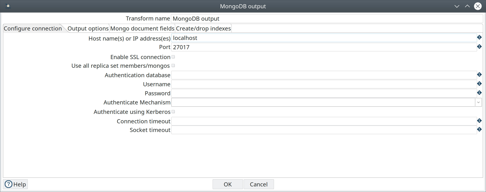
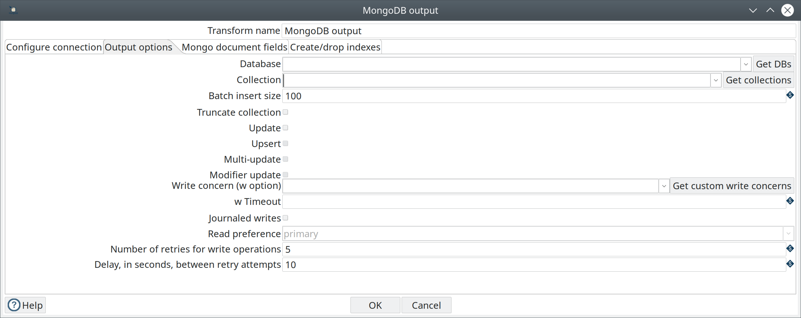
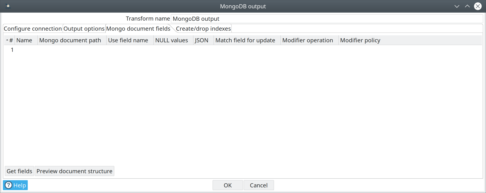
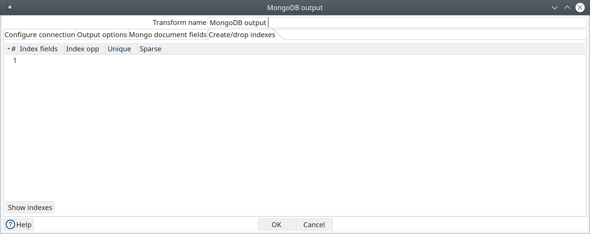

////
Licensed to the Apache Software Foundation (ASF) under one
or more contributor license agreements.  See the NOTICE file
distributed with this work for additional information
regarding copyright ownership.  The ASF licenses this file
to you under the Apache License, Version 2.0 (the
"License"); you may not use this file except in compliance
with the License.  You may obtain a copy of the License at
  http://www.apache.org/licenses/LICENSE-2.0
Unless required by applicable law or agreed to in writing,
software distributed under the License is distributed on an
"AS IS" BASIS, WITHOUT WARRANTIES OR CONDITIONS OF ANY
KIND, either express or implied.  See the License for the
specific language governing permissions and limitations
under the License.
////
:documentationPath: /pipeline/transforms/
:language: en_US
:page-alternativeEditUrl: https://github.com/apache/incubator-hop/edit/master/pipeline/transforms/mongodb/src/main/doc/mondodboutput.adoc

= MongoDB Output

== Description

The MongoDB Output pipeline transform can output data to a MongoDB database http://docs.mongodb.org/manual/reference/glossary/[collection].

For additional information about MongoDB, see the MongoDB http://www.mongodb.org/[documentation].

== Options

=== General

Transform name : Specify the unique name of the MongoDB Output transform in the pipeline.

=== Configure Connection tab



The *Configure connection* tab enables you to specify the database and collection for your output.

Enter the following information in the transform fields:


|===
|Field|Description

|Host name(s) or IP address(s)
|Specify the network name or address of the MongoDB instance(s). You can also specify a different port number for each host name by separating the host name and port number with a colon. You can input multiple host names or IP addresses, separated by a comma.

|Port
|Specify the port number of the MongoDB instance or instances. Use this to specify a default port if no ports are given as part of the host name(s) or IP address(es) field. The default value is 27017.

|Enable SSL connection
|Specify to connect to a MongoDB Server that is configured with SSL.

|Use all replica set members/mongos
|Select to use all replica sets when multiple hosts are specified in the Host name(s) or IP address(s) field.

If a replica set contains more than one host, the Java driver discovers all hosts automatically. The driver connects to the next replica set in the list if the set you try to connect to is down.

|Authentication database
|Specify the authentication database.

|Username
|Specify the username required to access the database. If you want to use Kerberos authentication, enter the Kerberos principal in this field.

|Password
|Specify the password associated with the username. If you are using Kerberos authentication, you do not need to enter the password.

|Authenticate Mechanism
|Select the method used to verify the identity of users. The values are SCRAM-SHA-1 and MONGODB-CR.

|Authenticate using Kerberos
|Select to specify authentication using Kerberos.

|Connection timeout
|Specify (in milliseconds) how long to wait for a connection to a database before terminating the connection attempt. Leave blank to never terminate the connection.

|Socket timeout
|Specify (in milliseconds) how long to wait for a write operation before terminating the operation. Leave blank to never terminate the operation.

|===

=== Output options tab



The Output options tab provides additional controls for inserting data into a MongoDB collection. If the specified collection does not exist, it is created before a document is inserted.

Enter the following information in the fields on this tab:


|===
|Option |Description

|Database
|Specify the target database for the output. When a valid hostname and port has been set, you can click Get DBs to retrieve the names of existing databases within a selected database.

|Collection
|Specify the target collection for the output. When a valid hostname and port has been set, you can click Get Collections to retrieve the names of existing collections within a selected database. If the specified collection does not exist, it will be created before data is inserted.

|Batch insert size
|Specify the batch size for bulk insert operations. The default value is 100 rows.

|Truncate collection
|Select to delete existing data in the target collection before inserting new data.

|Update
|Sets the update write method for the specified database and collection.

*The Upsert and Modifier update options are not available unless the Update field is selected.*

|Upsert
|Select to change the write method from insert to upsert. The upsert method replaces a matched record with an entire new record based on all the incoming fields specified in the Mongo document fields tab. A new record is created if match conditions fail for an update.

|Multi-update
|Select to update all matching documents for each update or upsert operation.

|Modifier update
|Select to enable modifiers ($ operators) to be used to modify individual fields within matching documents. All matching documents are updated when the Multi-update option is selected.

To update more than one matching document, select Modifier update and Upsert. Selecting Modifier update, Upsert, and Multi-update applies updates to all matching documents, instead of just the first.

|Write concern (w option)
|Specify the minimum number of servers that must succeed for a write operation. The values are:

-1 : Disables all acknowledgement of write operation errors

0 (Zero) : Disables basic acknowledgment of write operations, but returns information about socket excepts and networking errors

1 : Acknowledges write operations on the primary node

>1 : Wait for successful write operations to the specified number of slaves, including the primary.

Click *Get custom write concerns* to retrieve custom write concerns that you have stored in the repository.

|w Timeout
|Specify time (in milliseconds) to wait for a response to write operations before terminating the operation. Leave blank to never terminate.

|Journaled writes
|Select to set write operations to wait until the mongod (the primary daemon process for the MongoDB system) acknowledges the write operation and commits the data to the journal.

|Read preference
|Specify which node to read first:

- ```Primary```

- ```Primary preferred```

- ```Secondary```

- ```Secondary preferred```

- ```Nearest```

The default is ```Primary```.
The Read preference is available when Modifier update is selected.

|Number of retries for write operations
|Specify the number of times that a write operation is attempted.

|Delay, in seconds, between retry attempts
|Specify the number of seconds to wait before the next retry.

|===

=== Mongo document fields tab



Use the Mongo document fields tab to define how field values coming into the transform are written to a Mongo document.
The Modifier policy column controls when the execution of a modifier operation affects a particular field.
You can use modifier policies when the data for one Mongo document is split over several incoming Hop rows or
when it is not possible to execute different modifier operations that affect the same field simultaneously.

There are 2 helper buttons you can use:
* *Get fields* :Populates the Name column of the table with the names of the incoming fields.
* *Preview document structure* : Opens a dialog showing the structure that will be written to MongoDB in JSON format.

Enter the following information in the fields on this tab:


|===
|Column |Field Description

|Name
|Names of the incoming fields.

|Mongo document path
|The hierarchical path to fields in a document in dot notation format.

|Use field name
|Whether to use the incoming field name as the final entry in the path. The values are Y (use incoming field names) and N (do not use incoming field names). When set to Y, a preceding period (.) is assumed.

|NULL values
|Specifies whether to insert null values in the database. The values are:

- Insert NULL

- Ignore

|JSON
|Indicates the incoming value is a JSON document.

|Match field for update
|Indicates whether to match a field when performing an upsert operation. The first document in the collection that matches all fields tagged as Y in this column is replaced with the new document constructed with incoming values for all the defined field paths. If a matching document does not exist, then a new document is inserted into the collection.

|Modifier operation
|Specify in-place modifications of existing document fields.

The modifiers are:

- N/A

- ```$set``` : Sets the value of a field.

- ```$inc``` : Sets the value of a field if the field does not exist. If the field exists, increases (or decreases, with a negative value) the value of a field.

- ```$push``` : Sets the value of a field if the field does not exist. If the field exists, appends the value of a field.

- ```$``` : (the positional operator for matching inside of arrays).


|Modifier policy
|Controls when execution of a modifier operation affects a field. The values are:

- ```Insert&Update``` : The operation is executed whether or not a match exists in the collection (default).
The Insert&Update modifier policy (upsert) allows you to specify fields to match when performing an upsert operation.
Upsert only replaces the first matching document.
Modifier upserts can be used to replace certain field values in multiple documents.

- ```Insert``` : The operation is executed on an insert only (when the match conditions fail)

- ```Update``` : The operation is executed when match conditions succeed.

|===

==== Example

Here is an example of how you can define a document structure with an arbitrary hierarchy. Use the following input data and document field definitions to create the example document structure in MongoDB:

===== Input data

[source]
----
first, last, address, age
Bob, Jones ,"13 Bob Street", 34
Fred, Flintstone, "10 Rock Street",50
Zaphod, Beeblebrox, "Beetlejuice 1", 356
Noddy,Puppet,"Noddy Land",5
----

===== Document field definitions


|===
|Name|Mongo document path|Use field name|NULL values|JSON|Match field for update|Modifier operation|Modifier policy

|first
|top1
|Y
|
|N
|N
|N/A
|Insert&Update

|last
|array[O]
|Y
|
|N
|N
|N/A
|Insert&Update

|address
|array[O]
|Y
|
|N
|N
|N/A
|Insert&Update

|age
|array[O]
|Y
|
|N
|N
|N/A
|Insert&Update

|===

====== Document structure

[source]
{
  "top1" : {
    "first" : "<string val>"
   },
  "array" : [ { "last" : "<string val>" , "address" : "<string val>"}],
  "age" : "<integer val>"
}

=== Create/drop indexes tab



Use the Create/drop indexes tab to create and drop indexes on one or more fields.
Unless unique indexes are being used, MongoDB allows duplicate records to be inserted.
Indexing is performed after all rows have been processed by the transform.

You can use the *Show indexes button* to display a list of existing indexes.

Enter the following information in the fields in this tab:


|===
|Field|Description

|Index fields
|Specify a single index (using one field) or a compound index (using multiple fields). Compound indexes are specified by a comma-separated list of paths. Use dot notation to specify the path to a field to use in the index. An optional direction indicator can be specified: 1 for ascending or -1 for descending.

|Index opp
|Specify whether to create or drop an index.

|Unique
|Specify whether to index only fields with unique values.

|Sparse
|Specify whether to index only documents that have the indexed field.

|===

==== Create/drop indexes example

The following options defines the creation of a compound index of the "first" and "age" fields in ascending order:

|===
|Index fields|Index opp|Unique|Sparse

|top1.first,age
|Create
|N
|N

|===